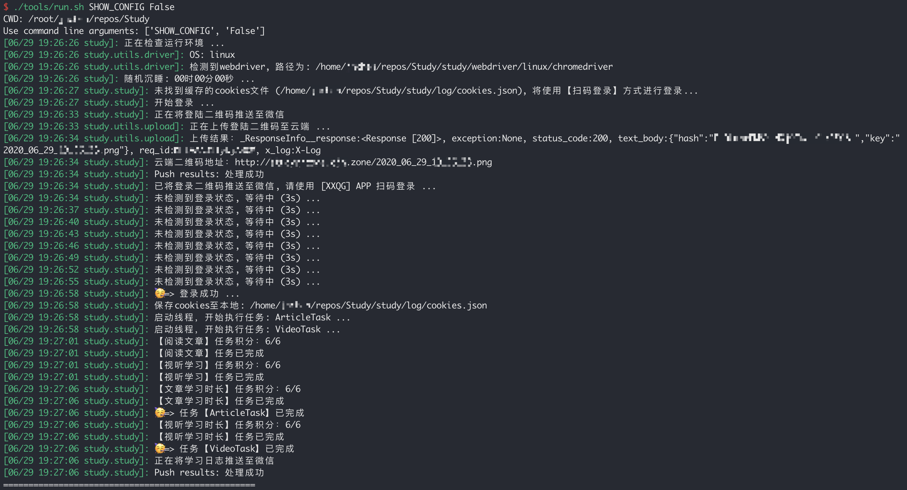

# Study

This is a useful project to help you learn XXQG.

<table border="0" cellpadding="2" align="center">
　<tr>
    <td></td>
    <td></td>
　</tr>
</table>


## TODO

- [ ] Add supports for windows (Only Linux now).

- [ ] Speed up.


## Usage

```bash
# Clone this project
git clone git@github.com:Study-Every-Day/Study.git

# Install requirements
# - Ubuntu
./tools/setup/ubuntu.sh
# - Others
# See: ## Reqirements

# Edit config module
vim ./study/config.py

# Run ([...] is optional parameter configuration)
./tools/run.sh [cfg args]
# Or
python study/main.py [cfg args]

# Examples: use command line arguments
./tools/run.sh DRIVER.GUI True
python study/main.py DRIVER.GUI True
```


## Reqirements

1. Python version >= 3.6.

2. You should install chrome latest version before run this project.

3. And you should also install third-party libs recorded in file: `requirements.txt`:

    > ```shell
    > pip install -r requirements.txt
    > ```


## Run regularly in the server

```shell
crontab -e
# add new line in file end:
# m h  dom mon dow   command
0 12 * * * /abs/path/to/tools/run.sh
```

> If you want the program to sleep randomly for a period of time before running, you can set item cfg.MAX_SLEEP_TIME_BEFORE_START in `study/config.py` module.
